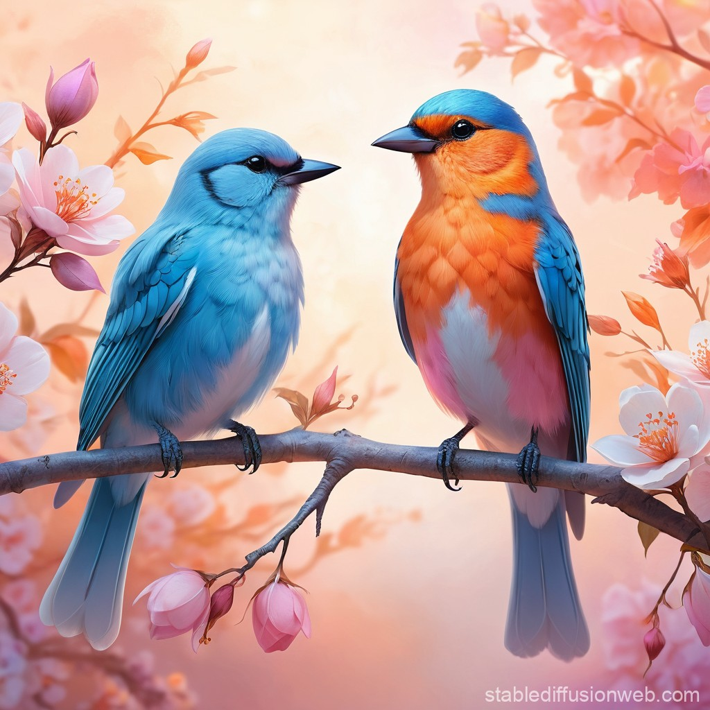

# Reproducing-an-Image-Using-Prompts-for-Image-Generation
Done by: Kaushika A  
Reg no : 212221230048

## Aim:
- To demonstrate the ability of text-to-image generation tools to reproduce an existing image by crafting precise prompts. 
- The goal is to identify key elements within the image and use these details to generate an image as close as possible to the original.

## Tools/LLMs for Image Generation:
- `DALL·E (by OpenAI):` A text-to-image generation tool capable of creating detailed images from textual prompts.
    - `Website:` DALL·E
- `Stable Diffusion:` An open-source model for generating images from text prompts, known for its flexibility and customizable outputs.
    - `Website:` Stable Diffusion
- `MidJourney:` A popular AI tool for generating visually striking and creative images based on text descriptions.
    - `Website:` MidJourney

## Procedure:
### 1. Analyze the Given Image:
- Examine the image carefully, noting key elements such as:
    - Objects/Subjects (e.g., people, animals, objects)
    - Colors (e.g., dominant hues, contrasts)
    - Textures (e.g., smooth, rough, glossy)
    - Lighting (e.g., bright, dim, shadows)
    - Background (e.g., outdoor, indoor, simple, detailed)
    - Composition (e.g., focal points, perspective)
    - Style (e.g., realistic, artistic, cartoonish)
- In this experiment we will be examining two images to replicate:
    - Image 1 :  
    - 
    - Key elements:
        - Objects : Rockes on the shore of an ocean with water flowing on top of it
        - Colors : Complementing colors of sunset and grey rocks with blue undertones of the sea
        - Textures : soft, smooth, blunt
        - Lighting: Dim, sun-influenced lighting
        - Background: It is a sunset where the sun has almost set and the sky is getting darker 
        - Composition : The focal length is 13mm with the camera positioned to capture the image focued from bottom towards the sunset sky
        -  Style : Realistic photography style
    - Image 2:
    -  
    - Key elements:
        - Objects : Two birds sitting on a branch
        - Colors : Dominant shades of orange, light teal,various shades of pink and white
        - Texture : smooth, crisp, detailed
        - Lighting : light is bright at the center and slightly dim on the corners
        - Background : A sun-lit background behind the birds
        - Composition : The images is focued on the center with the birds as the primary focus, as the image slowly blurs on the corners
        - Style: Artistic painting style
### 2. Create the Basic Prompt:
- Write an initial, simple description of the image.
- Image 1 Prompt: "A vibrant sunset in the middle of the shores of a beach"
- 
- Image 2 Prompt: "Two birds sitting facing eachother on a branch around flowers"
- 
### Refine the Prompt with More Detail:
- Add specific details such as colors, mood, and time of day. 
- Image 1 refined prompt: "A softly vibrant sunset at 5:30 PM in the middle of the rocks on the shores of a beach with waves softly hitting the rocks."
- 
- Image 2 refined prompt: "Two blue & orange- colored birds sitting on a branch facing eachother on a branch around flowers of different shades of pink and white"
- 

### Identify Style and Artistic Influences:
- If the image has a particular style (e.g., impressionist painting, realistic photography, minimalistic), include that in the prompt. 
- Image 1 improved prompt: "A photograph image of a softly vibrant sunset at 5:30 PM in the middle of the rocks on the shores of a beach with waves softly hitting the rocks. The camera should have a 13mm focal length with the sunset background in the middle and the camera should capture the image in a bottom positioned way, capturing the water hitting the rocks first"
- Image 2 improved prompt: "A realistic painting of Two fluffy blue & orange- colored birds sitting closely next to each other on a thin branch facing each other surrounded by various flowers of different shades of pink and white. The background is a soft and blurred sunny sky where the sun focuses softly behind the birds and clouds slowly dim the light in a circular way."
### Generate the Image:
- Use the crafted prompt to generate the image in a text-to-image model 
- Generated Image for Image 1:  
- Generated Image for Image 2:  
### Adjust and Fine-tune:
- Refine the prompt further by adding specific instructions about elements
- Image 1:
    - Prompt: "A photograph image of a softly vibrant sunset in a foggy atmosphere at 5:30 PM in the middle of the rocks on the shores of a beach with waves softly hitting the rocks. The camera should have a 13mm focal length with the sunset background in the middle, and the camera should capture the image in a bottom-positioned way, capturing the water hitting the rocks first"
    - Image:   
- Image 2:
    -  Prompt: "A realistic colored sketch of Two fluffy blue & orange- colored birds sitting closely next to each other on a thin branch facing each other surrounded by various flowers of different shades of pink and white. The background is a soft and blurred sunny sky where the sun focuses softly behind the birds and clouds slowly dim the light in a circular way."
    - Image:   

## Conclusion:
By using detailed and well-crafted prompts, text-to-image generation models can be effective in reproducing an image closely. The quality of the generated image depends on how accurately the prompt describes the image's key elements. The experiment demonstrates the importance of prompt refinement and iteration when working with AI tools to achieve desired outcomes. With practice, the model can generate images that closely match real-world visuals, which is useful for creative and practical applications.

